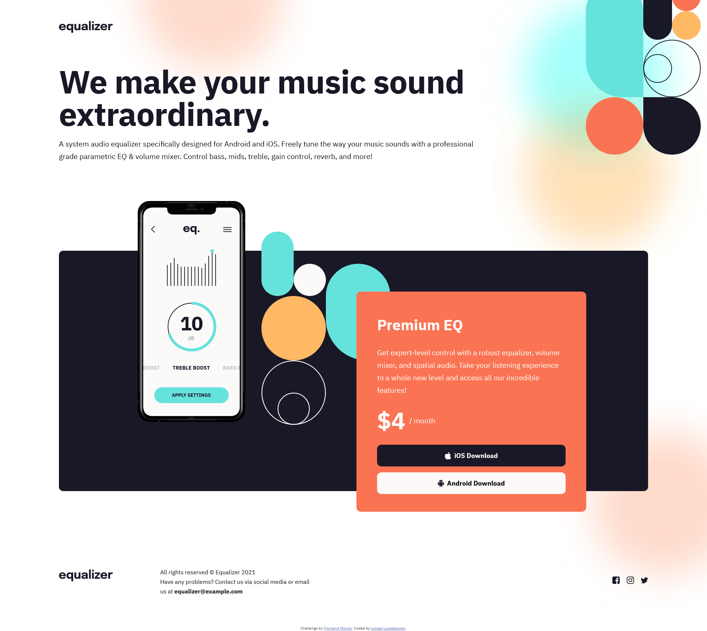

# Frontend Mentor - Equalizer landing page solution

This is a solution to the [Equalizer landing page challenge on Frontend Mentor](https://www.frontendmentor.io/challenges/equalizer-landing-page-7VJ4gp3DE). Frontend Mentor challenges help you improve your coding skills by building realistic projects. 

## Table of contents

- [Frontend Mentor - Equalizer landing page solution](#frontend-mentor---equalizer-landing-page-solution)
  - [Table of contents](#table-of-contents)
  - [Overview](#overview)
    - [The challenge](#the-challenge)
    - [Screenshot](#screenshot)
    - [Links](#links)
  - [My process](#my-process)
    - [Built with](#built-with)
    - [What I learned](#what-i-learned)
  - [Author](#author)

## Overview

### The challenge

Users should be able to:

- View the optimal layout depending on their device's screen size
- See hover states for interactive elements

### Screenshot



### Links

- Solution URL: [Frontend Mentor solution](https://www.frontendmentor.io/solutions/mobilefirst-equalizer-page-using-scss-Wso5oVGi8O)
- Live Site URL: [Github Pages](https://luckyszakul0.github.io/FM-Equalizer-landing-page/)

## My process

### Built with

- Semantic HTML5 markup
- SCSS custom properties
- Flexbox
- SCSS mixins
- Mobile-first workflow
- [SCSS](https://sass-lang.com/) - CSS preprocessor

### What I learned

In this project, the correct positioning of background images and correctly aligning the absolute elements were the hardest things for me, but I think that in the end - I managed to do it right. I'm longing for doing some logic with JS, I had a bit too much CSS i guess. Or maybe I should finally try Tailwind.

```css
  background-image: url('../assets/bg-main-mobile.png');
  background-repeat: no-repeat;
  background-position: top -225px right -225px;

  @media screen and (min-width: 650px) {
    background-image: url('../assets/bg-main-tablet.png');
    background-position: top -350px right -225px;
  }

  @media screen and (min-width: 1050px) {
    background-image: url('../assets/bg-main-desktop.png');
  }
```

## Author

- Github - [Łukasz Lubaszewski](https://github.com/luckyszakul0)
- Frontend Mentor - [@luckyszakul0](https://www.frontendmentor.io/profile/luckyszakul0)
